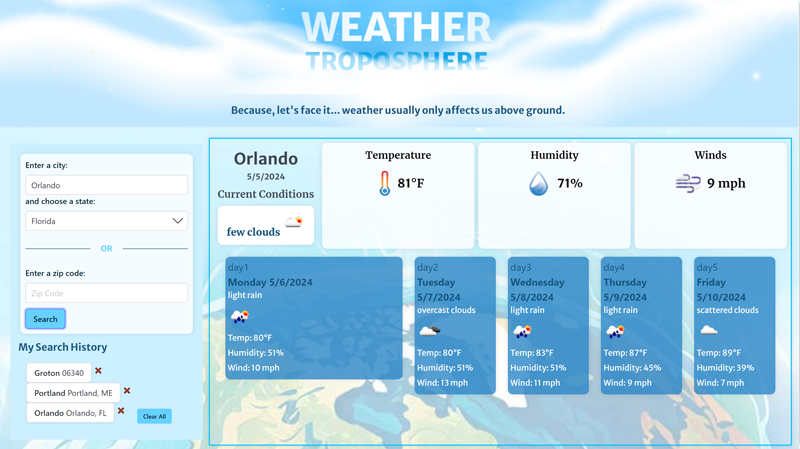

# Weather Troposphere

Because, let's face it, weather usually affects us *above* ground.

Image credit: Vecteezy.com
[Atmosphere Vectors by Vecteezy](https://www.vecteezy.com/free-vector/atmosphere)
[Sky Blue Background Vectors by Vecteezy](https://www.vecteezy.com/free-vector/sky-blue-background)
[Humidity Vectors by Vecteezy](https://www.vecteezy.com/free-vector/humidity)
Other visuals created by Heidi Harmony Carrier (me!)

## Table of Contents

[About](#about)
[Frequently Asked Questions](#frequently-asked-questions)  
[Plans for Future Development](#plans-for-future-development)  
[Report Issues](#report-issues)
[About the Author](#about-the-author)

### About

Find it at [https://heidiharmony.github.io/weather-troposphere/](https://heidiharmony.github.io/weather-troposphere/)
Project repo on github at [https://github.com/HeidiHarmony/weather-troposphere](https://github.com/HeidiHarmony/weather-troposphere)

Weather Troposphere is a weather application powered by [openweathermap.org](https://openweathermap.org/) that will show the current conditions as well as a five-day forecast for the location of your choosing. You may search by city and state, or by zipcode. The information is simple and aimed at the user who would like to easily track weather in multiple locations, such as for use in planning a vacation. Save your favorite locations to pull up data in one click of a button. Weather Troposphere has no advertising cluttering your screen; just a soothing color scheme that makes you feel like you are floating in the clouds. Where weather happens.

### Frequently Asked Questions

Q: Why is it called "Weather Troposphere"?
A: The developer has been a user of the popular app "Weather Underground" for many years, but always thought that the title was misleading, and perhaps only applicable to earthworms. With Weather Troposphere, we recognize that you are a surface dweller making weather-informed decisions in your life, not an earthworm who wants to plan for their next trip to the surface due to rain. The troposphere is, according to [Wikipedia](https://en.wikipedia.org/wiki/Troposphere), "the lowest layer of the atmosphere of Earth. It contains 80% of the total mass of the planetary atmosphere and 99% of the total mass of water vapor and aerosols, and is where most weather phenomena occur."

Q: What if I make a mistake in my search and get the wrong location? It's automatically saved to my search history now.
A: Never fear! You can clear individual locations by clicking the red X that appears to the right of a location button to remove that location, or use the Clear All button to remove all searches.

### Plans for Future Development

- Further maximization of space for each data container
- Offer a dark mode which shows a night sky, and allow user to choose light, dark, or have the theme automatically change by device settings or local time
- Customize weather icons to be used in place of the Open Weather API icons
- Customize backgrounds for weather conditions
- Offer a morning, afternoon, and night detail view for the five day forecast

### Report Issues

You can report any issues at [github](https://github.com/HeidiHarmony/weather-troposphere/issues).

### About the Author

My name is Heidi Harmony Carrier and I am a graphic designer and web development student. My coding interests include user interface and user experience, databases, and regex. My non-coding interests include music, art, animals, crystals, and spirituality. You can find me on github as [HeidiHarmony](https://github.com/HeidiHarmony) and on [linkedin](https://www.linkedin.com/in/heidi-carrier-dual-hemisphere/).
